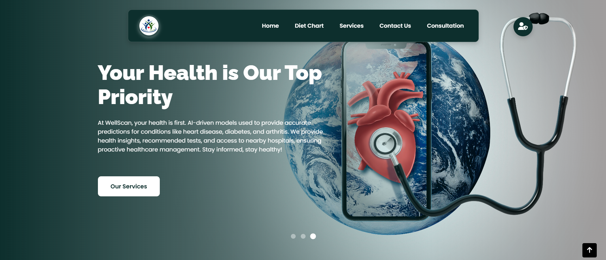
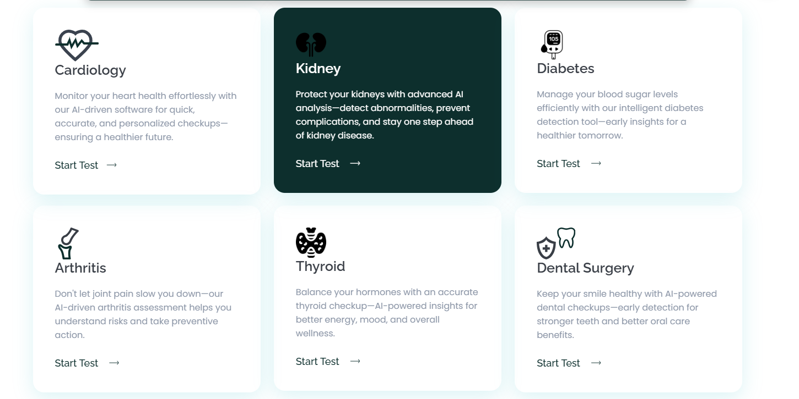

# 🚀 **Well Scan – The Ultimate AI-Powered Health Dashboard**  

**Well Scan** is a cutting-edge AI-driven healthcare platform that provides real-time medical insights, personalized organ check-ups, doctor booking, and holistic health management in a single, unified interface. The platform leverages advanced machine learning models and seamless web technologies to empower users with proactive healthcare solutions.  

 


---

## 🎯 **Key Features**  

### 1️⃣ **AI-Powered Individual Organ Checkups**  
Upload your medical reports and receive accurate predictions of potential health risks using AI models:  
- **Heart Checkup** – Detects cardiovascular anomalies.  
- **Kidney Checkup** – Assesses kidney health and detects risks.  
- **Thyroid Checkup** – Predicts thyroid disorders based on medical data.  
- **Arthritis Checkup** – Analyzes joint health and potential arthritis risks.  
- **Liver Checkup** – Identifies early signs of liver-related diseases.  

### 2️⃣ **AI Chatbot – 24/7 Health Assistance**  
Get instant responses to health-related questions and preventive care tips with a virtual health assistant that ensures continuous medical guidance.  

### 3️⃣ **Doctor Booking System**  
- Schedule appointments with specialists from various medical fields.  
- Securely pay for consultations through an integrated payment gateway.  
- Receive timely reminders and updates about upcoming appointments.  

### 4️⃣ **Personalized User Dashboard**  
- Access previous checkup results and medical reports.  
- Monitor health improvements over time.  
- Ensure data privacy and security with encrypted storage.  

### 5️⃣ **Nearby Hospital Locator**  
Quickly locate nearby hospitals in case of emergencies to ensure timely medical assistance.  

### 6️⃣ **Holistic Health Support**  
- Personalized medication reminders.  
- Exercise and yoga recommendations.  
- Health charts and insights for chronic conditions (e.g., diabetes, hypertension).  

---

## 🛠️ **Tech Stack**  

### 🔹 **Backend**  
- Python  
- Django  
- REST APIs  

### 🔹 **Frontend**  
- HTML, CSS, JavaScript  
- Bootstrap  

### 🔹 **AI/ML Models**  
- Scikit-learn  
- TensorFlow/Keras  
- Pandas & NumPy  

### 🔹 **Database**  
- PostgreSQL / MySQL  

---

## 📚 **System Architecture**  
```bash
/WELL_SCAN
├── /Health_Checker
│   ├── /Health_Checker
│   │   ├── __pycache__
│   │   ├── asgi.py
│   │   ├── settings.py
│   │   ├── urls.py
│   │   └── wsgi.py
│   ├── /Notebooks
│   ├── /organs
│   │   ├── __pycache__
│   │   ├── migrations
│   │   ├── uploads
│   │   ├── __init__.py
│   │   ├── admin.py
│   │   ├── app.py
│   │   ├── apps.py
│   │   ├── forms.py
│   │   ├── models.py
│   │   ├── tests.py
│   │   ├── urls.py
│   │   └── views.py
│   ├── /savedModels
├── /static
├── /templates
├── db.sqlite3
└── manage.py
```

---

## 📄 **Installation and Setup**  

### 1. Clone the Repository  
```bash
git clone https://github.com/username/well-scan.git
cd well-scan
```

### 2. Create and Activate Virtual Environment  
```bash
python3 -m venv venv
source venv/bin/activate   # For Linux/Mac
# OR
venv\Scripts\activate      # For Windows
```

### 3. Install Required Dependencies  
```bash
pip install -r requirements.txt
```

### 4. Apply Migrations  
```bash
python manage.py makemigrations
python manage.py migrate
```

### 5. Run the Application  
```bash
python manage.py runserver
```


---

## 📊 **ML Model Pipeline**  
1. **Data Preprocessing** – Cleaning and transforming input medical data.  
2. **Feature Engineering** – Extracting relevant features for organ-specific models.  
3. **Model Training** – Training and validating models using Scikit-learn and TensorFlow.  
4. **Model Integration** – Deploying models in the Django backend for real-time predictions.  

---

## 📚 **Project Workflow**  
- **Data Collection & Preprocessing** – Aggregated medical datasets and applied feature engineering.  
- **Model Development** – Built and trained models for organ health prediction.  
- **API Integration** – Integrated ML models into the backend through REST APIs.  
- **Frontend & Dashboard** – Developed an intuitive and responsive user interface.  

---

## 📧 **Contact**  
For any queries, suggestions, or contributions, feel free to reach out:  
- **Email:** [avadheshkumarshah578@gmail.com](avadheshkumarshah578@gmail.com)  
- **GitHub Repository:** [(https://github.com/avadheshgithub/Well-Scan)](https://github.com/avadheshgithub/Well-Scan)

---

## 📜 **License**  
This project is licensed under the [MIT License](LICENSE).  

